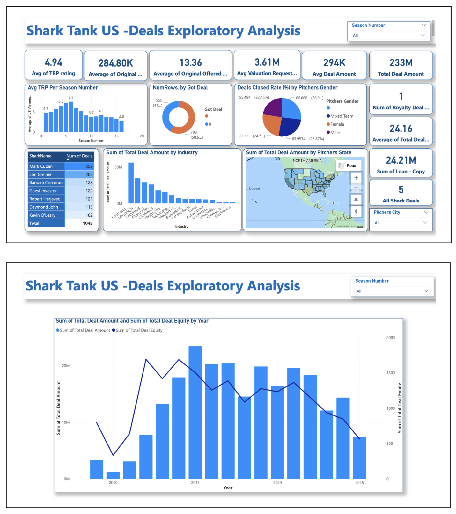

Shark Tank US - Exploratory Data Analysis
This project is an exploratory data analysis of the Shark Tank US dataset, created using Power BI. The dashboard provides a comprehensive view of deal performance, investor contributions, and key trends across multiple seasons.
Project Goal
The primary goal of this project was to transform raw data into actionable insights. By creating an interactive dashboard, I aimed to uncover patterns in investment trends, analyze the performance of individual "sharks," and identify the key factors that lead to a successful deal on the show.
Data Source
The dataset was sourced from a publicly available Excel workbook containing information about every pitch from several seasons of Shark Tank US. The dataset includes details on pitch value, deal amounts, company valuations, and the investors involved.
Key Findings
Deal Success Rate: The data revealed the percentage of pitches that successfully secured a deal with at least one shark.
Investment Trends: I was able to analyze how the average investment amount and company valuation have changed over the different seasons.
Top-Performing Sharks: The dashboard provides a clear breakdown of the total number of deals closed by each shark, highlighting the most active investors.
Geographical Insights: The filled map visual helped identify which US states had the highest deal amounts, providing a geographical perspective on investment activity.
Technologies Used
Power BI Desktop: Used for data connection, transformation, modeling, and report visualization.
Power Query: Utilized to clean and prepare the raw data, handling errors and ensuring data quality.
DAX (Data Analysis Expressions): Employed to create custom measures and calculated tables, including:
Average Investment per Deal: A measure to calculate the average amount of money invested in successful deals.
Deal Closed Rate: A measure to show the percentage of pitches that resulted in a deal.
Deals per Shark: A calculated table to summarize each shark's individual performance.
Dashboard Screenshots
